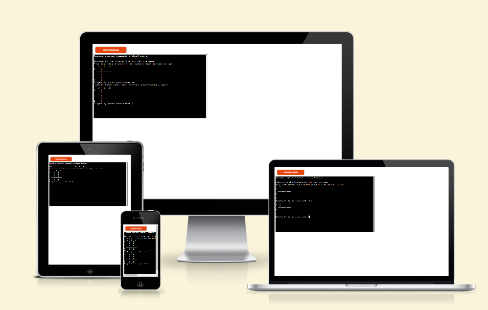
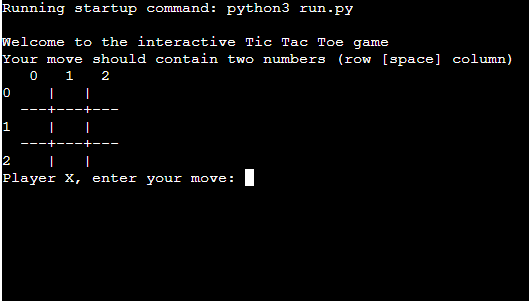
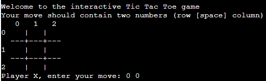
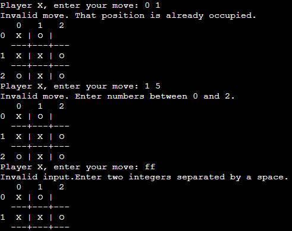
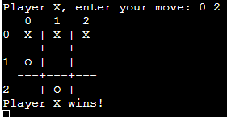
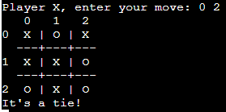
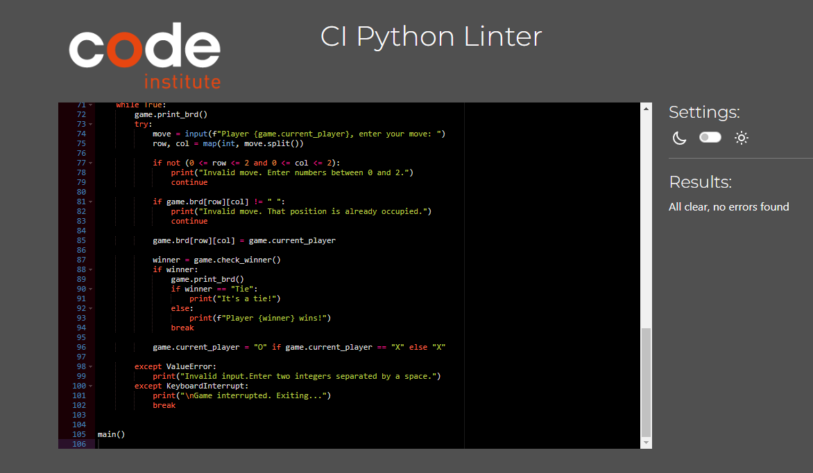

# Tic-Tac-Toe Game

## 1 Purpose of the project

This is a Python implementation of the classic game Tic-Tac-Toe. The game allows two players to take turns entering their moves and updates the game board accordingly. The players are represented by "X" and "O". The game continues until there is a winner or a tie.

### Usage

To play the game, follow these steps:

1. Run the `main()` function.
2. The game will display an empty 3x3 grid representing the game board.
3. Players will be prompted to enter their moves. Each move should contain two numbers, representing the row and column of the desired position on the board.
4. The game validates the input and checks if the move is valid. If the move is not valid (e.g., out of bounds or the position is already occupied), an error message will be displayed, and the player will be prompted to enter a new move.
5. The game updates the board with the player's move and checks if there is a winner or a tie.
6. If there is a winner, the game displays the winning player and ends.
7. If there is a tie, the game displays a tie message and ends.
8. If there is no winner yet, the game switches the current player and continues to the next turn.

## 2 User Stories

The following user stories describe the functionality of the Tic-Tac-Toe game:

- As a player, I want to see the current state of the game board, so I know where to make my move.

  

- As a player, I want to be able to input my move by specifying the row and column, so I can place my symbol on the board.

  

- As a player, I want the game to validate my move and display an error message if it is not valid, so I can enter a valid move.

  

- As a player, I want the game to check if there is a winner after each move, so I know if I have won the game.

  

- As a player, I want the game to check for a tie if there are no more valid moves, so I know if the game ended in a tie.

  

## 3 Features

- Interactive game board: The current state of the game board is displayed after each move, allowing players to see the positions and plan their next moves accordingly.
- Input validation: The game validates the player's move and checks if it is a valid position on the board. If the move is not valid (e.g., out of bounds or the position is already occupied), an error message is displayed, and the player is prompted to enter a new move.
- Win condition check: After each move, the game checks if there is a winner. It examines the rows, columns, and diagonals to determine if a player has achieved three in a row. If a winner is found, the game ends and displays the winning player.
- Tie condition check: If there are no more valid moves and no winner has been determined, the game checks for a tie. If all positions on the board are occupied and no player has won, the game ends and displays a tie message.
- Interruption handling: Players can interrupt the game at any time by pressing Ctrl+C (KeyboardInterrupt). The game gracefully handles the interruption and displays a message before exiting.
- Clear and informative messages: The game provides clear and informative messages throughout the gameplay, guiding the players and providing feedback on the game flow and any errors that occur.

## 4 Technologies Used

- Heroku
- Python
- GitPod
- GitHub
- Visual Studio

## 5. Testing

1. As a developer, I want to test the game's behavior when a valid move is made, to ensure the board is updated correctly.

2. As a developer, I want to test the game's behavior when an invalid move is made, to ensure appropriate error messages are displayed.

3. As a developer, I want to test the game's behavior when a player wins, to ensure the correct winning message is displayed.

4. As a developer, I want to test the game's behavior when there is a tie, to ensure the tie message is displayed.
5. As a developer, I want to test the game's interruption handling, to ensure the game exits gracefully when interrupted.
6. As a developer, I want to test the game's output messages, to ensure they are clear, informative, and displayed at the right time.
7. As a developer, I want to test the game's initialization, to ensure the board is set up correctly and the starting player is "X".

### CI Python Linter

## 6. Deployment

### On Github:

- The project was deployed on GitHub, after I created a new repository and wrote the program in Git Pod, I selected my project in Git Hub repository, after this I selected my project from the menu on the left.

- Then I clicked on Settings and from the settings menu on the left I clicked on the Pages button

- Then from the Branch section I chose "main".

- At the end, I entered the domain name bogdan131992.github.io in Custom domain

- I clicked on save.

- I was informed that the deployment process was successful and I received a link for my website

- [Github -Link](https://github.com/Bogdan131992/Project3TicTacToe)

### On Gitpod:

From the github page I select my project, then I click on Gitpod green button.
- Then I selected New Workspace and then entered in the online programming environment.
- From the menu on the left, I selected the option to create new files and created the necessary files for the project
- In a folder I put all the necessary images that I downloaded from the Internet
- I entered the command python -m http.server in the terminal to open a live server
- To save the changes, I entered the git add command in the terminal
- Also I used in the terminal  git commit -m "" to commit the changes 
- And then to push the changes to Github I used the git push command in the terminal.

### On Heroku:

- From the Heroku dashboard  we’ll click the “Create new app” button here then go to the deploy section.  
 - And here we can choose our deployment method.
-  Confirm that we want to connect to Github and  search for Github repository name,  
- And then we can click “connect”  to link up our Heroku app to our  Github repository code. 
- Then  you can choose to  manually deploy using this deploy branch option here.  
-  Finally we see the “App was  successfully deployed” message  
and a button to take us to our deployed  link.
- [Heroku - live link](https://project3tictactoe.herokuapp.com/)

## 7. Credits

- The check winners check function is similar to the example presented in this [Github project](https://gist.github.com/jason-feng/670dc37907ff54af4728)
